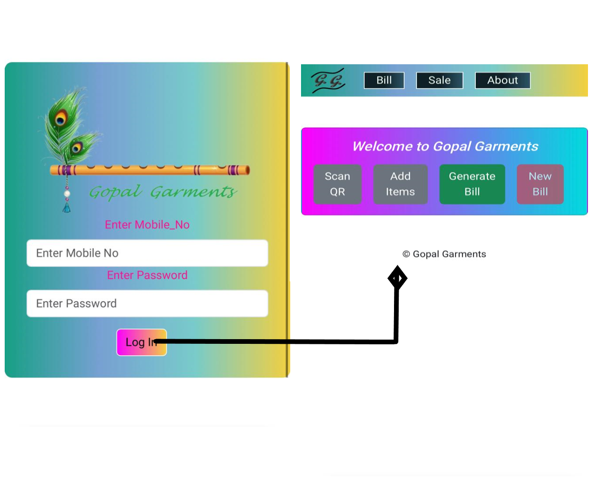
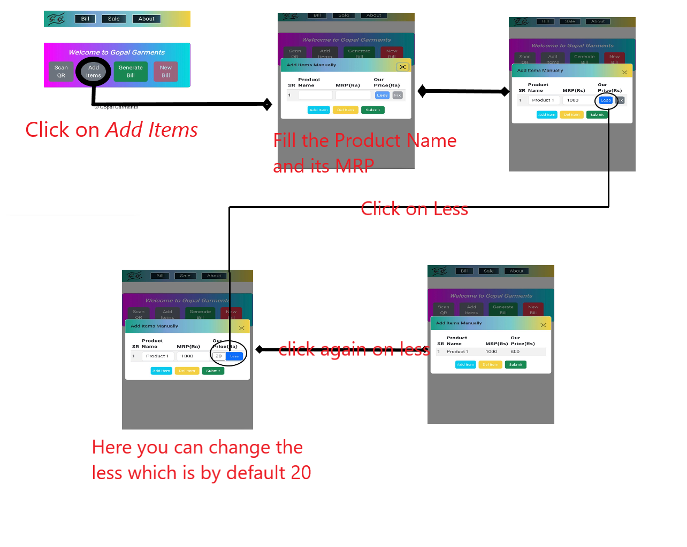
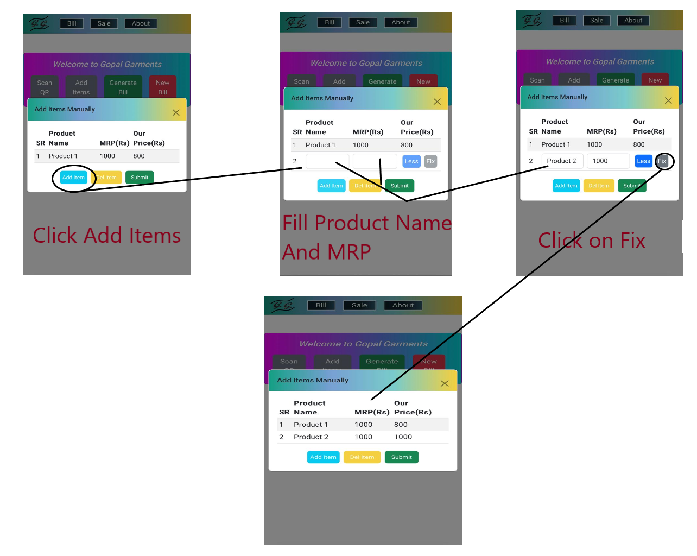
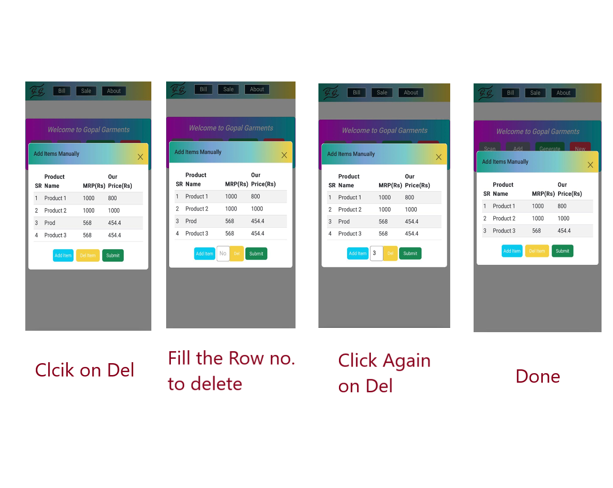
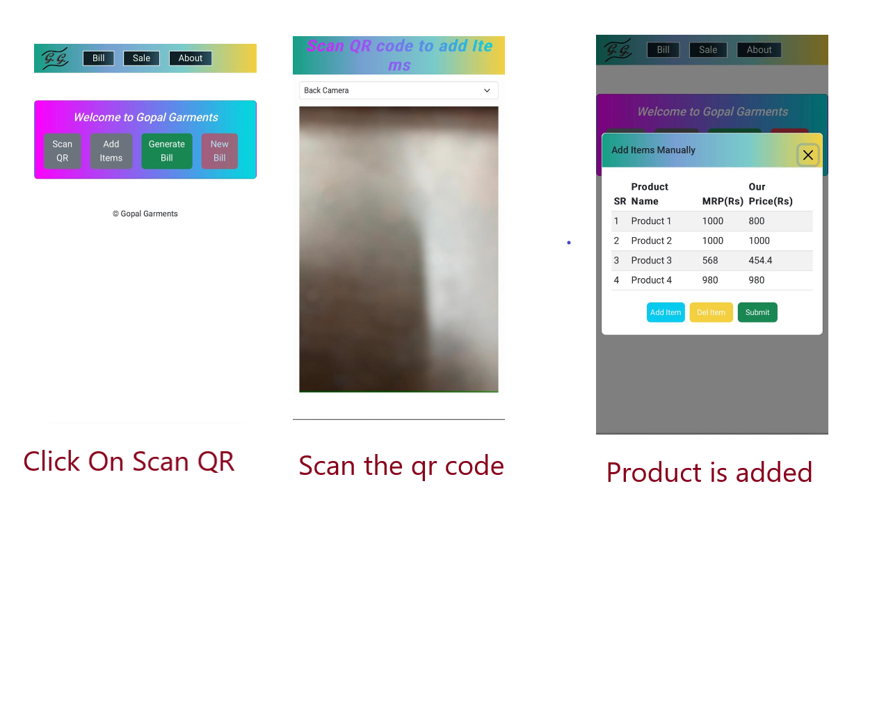
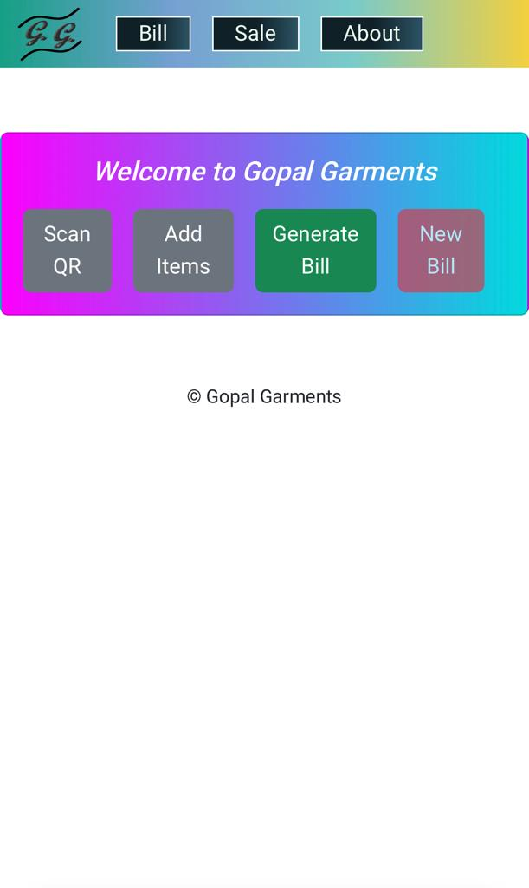
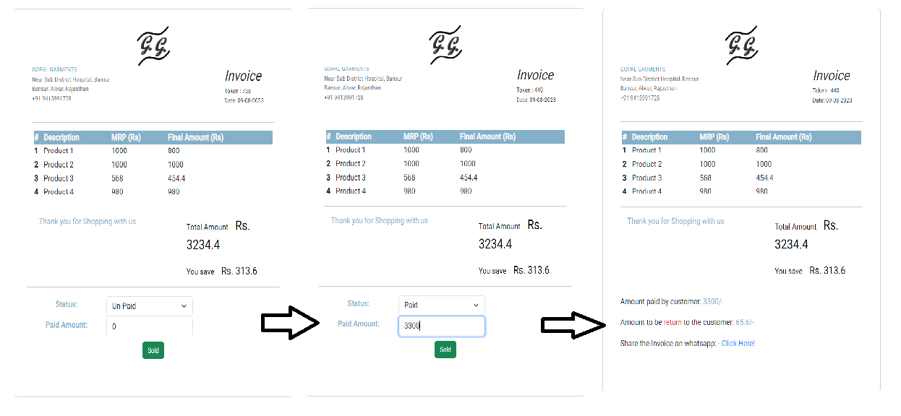
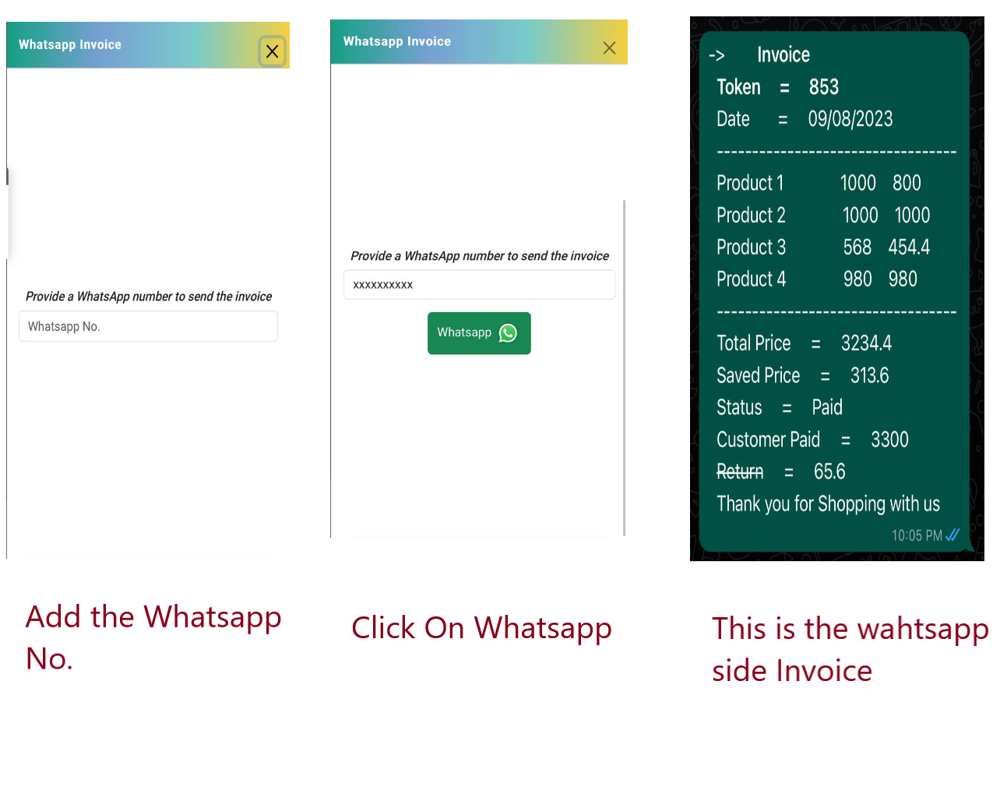

# MyShopProject

This project was generated with [Angular CLI](https://github.com/angular/angular-cli) version 16.1.4.

## Development server

Run `ng serve` for a dev server. Navigate to `http://localhost:4200/`. The application will automatically reload if you
change any of the source files.

## Hosting

The Application is hosted on GitHub
at [https://hritesh1728.github.io/shopInvoiceProject/main_page](https://hritesh1728.github.io/shopInvoiceProject/main_page)

## Tutorial

  1. Login with the mobile no. and password that you will get in **_login.component.ts_** file for navigating to the main
   page.  
    
  2. If you want to add the items manually which have a less. You can do it like this:-  
     
  3. If you want to add another item manually which doesn't have a less. You can do it like this:-  
     
  4. You can delete items as follows:-  
     
  5. You can also scan the Qr codes as follows to add items:-  
     
  6. Finally, you can generate the bill, update its status and send the bill via WhatsApp as follows:-
     - Click on generate bill:-  
       
     - Update the Status:-  
       
     - WhatsApp the Invoice on any number:-  
       

## 🚀 About Me

**Name:** &nbsp;&nbsp;&nbsp;&nbsp;&nbsp;&nbsp;&nbsp;&nbsp;&nbsp;&nbsp;&nbsp;&nbsp;&nbsp;&nbsp;&nbsp;_Hritesh_

**Graduation:**&nbsp;&nbsp;&nbsp;&nbsp;&nbsp;&nbsp; BTech from the _Indian Institute of Technology, Kanpur_

**Email:**
&nbsp;&nbsp;&nbsp;&nbsp;&nbsp;&nbsp;&nbsp;&nbsp;&nbsp;&nbsp;&nbsp;&nbsp;&nbsp;&nbsp;&nbsp;&nbsp;hriteshalw1728@gmail.com

**GitHub:**
&nbsp;&nbsp;&nbsp;&nbsp;&nbsp;&nbsp;&nbsp;&nbsp;&nbsp;&nbsp;&nbsp;&nbsp;&nbsp;[Hritesh1728](https://github.com/Hritesh1728)

**Profession:**&nbsp;&nbsp;&nbsp;&nbsp;&nbsp;&nbsp; "_Enthusiastic Fresher Software Developer Eager to Innovate and
Learn_"

